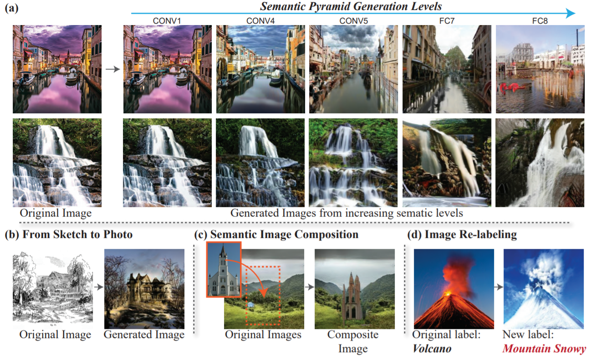
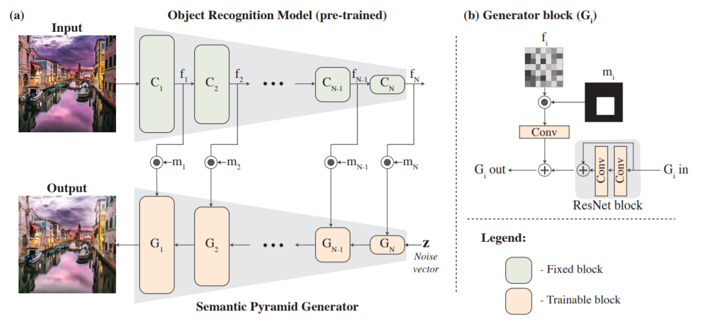
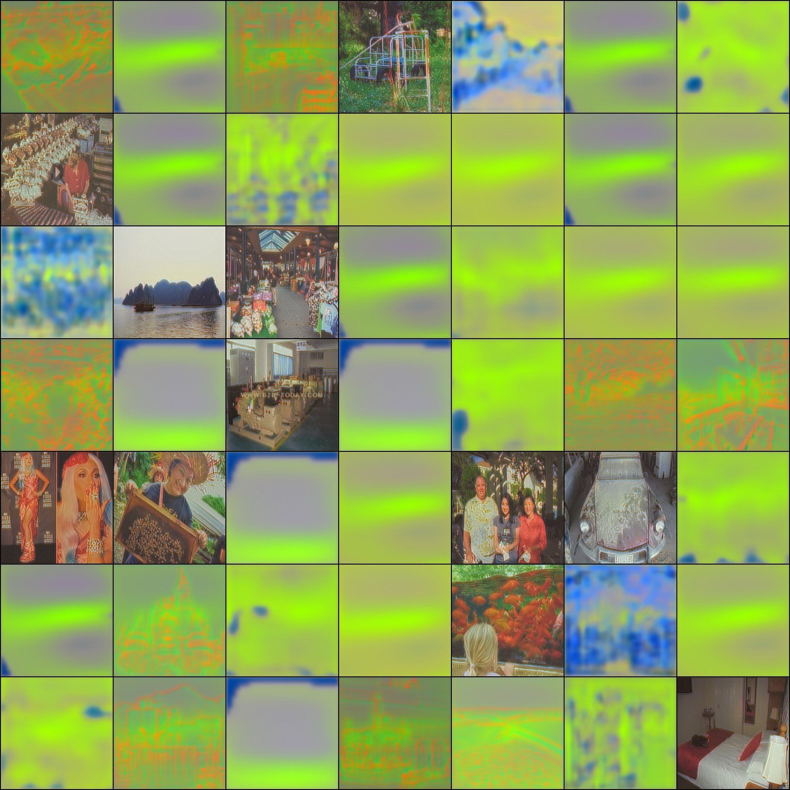

# Semantic Pyramid for Image Generation
[](https://github.com/ChristophReich1996/Semantic_Pyramid_for_Image_Generation/blob/master/LICENSE)

**Unofficel** [PyTorch](https://pytorch.org/) implementation of the paper [Semantic Pyramid for Image Generation](https://arxiv.org/pdf/2003.06221.pdf) by [Assaf Shocher](https://github.com/assafshocher), Yossi Gandelsman et al.


[Source](https://arxiv.org/pdf/2003.06221.pdf). Proposed results of the paper.

## Model Architecture


[Source](https://arxiv.org/pdf/2003.06221.pdf)

The full architecture consists of three parts. First, the object recognition model which is implemented as a
pre-trained VGG 16 network. Secondly, the residual generator network which is partly based on the generator architecture 
of the [SAGAN](https://arxiv.org/pdf/1805.08318.pdf).
And thirdly, the residual discriminator network which is also based on the 
[SAGAN](https://arxiv.org/pdf/1805.08318.pdf).

## Dataset
To download and extract the [places365](http://places2.csail.mit.edu/download.html) dataset from the official website
run the following script
```
sh download_places365.sh
```
## Trained VGG-16
The original VGG-16 provided by the [MIT CV group](https://github.com/CSAILVision/places365) is trained on a resolution
of 224 x 224. This implementation, however, utilizes the native resolution (256 x 256) of the 
[places365](http://places2.csail.mit.edu/download.html) dataset. This issue is addressed by fine-tuning the pre-trained 
VGG-16 network on the higher resolution.

The necessary fine-tuned VGG-16 state dict can be downloaded [here](https://studtudarmstadtde-my.sharepoint.com/:u:/g/personal/christoph_reich_stud_tu-darmstadt_de/EaqFAsNXcYZNgcoYxwLQJrIB0YLsWuiT8rD4I3HnWrwhNg?e=YLmMGn).

To download and convert the original VGG-16 model pre-trained on the lower resolution (224 x 224) places dataset run the 
following command. The downloaded model can be fine-tuned on the higher resolution by using the 
[training script](/vgg_16_train.py), which is based on the 
[original training script](https://github.com/CSAILVision/places365/blob/master/train_placesCNN.py).
```
sh download_pretrained_vgg16.sh
```
This script downloads the official pre-trained caffe models from the
[places365 repository](https://github.com/CSAILVision/places365). Afterwards, the caffe model gets converted with the
help of the [caffemodel2pytorch](https://github.com/vadimkantorov/caffemodel2pytorch) repo created by 
[Vadim Kantorov](https://github.com/vadimkantorov).

## Usage
To train or test the GAN simply run the main script `python main.py`. This main script takes multiple arguments.

Argument | Default value | Info
--- | --- | ---
`--train` | False | Flag to perform training
`--test` | False | Flag to perform testing
`--batch_size` | 20 | Batch size to be utilized
`--lr` | 1e-04 | Learning rate to use
`--channel_factor` | 1 | Channel factor adopts the number of channels utilized in the U-Net
`--device` | 'cuda' | Device to use (cuda recommended)
`--gpus_to_use` | '0' | Indexes of the GPUs to be use
`--use_data_parallel` | False | Use multiple GPUs
`--load_generator_network` | None | Path of the generator network to be loaded (.pt)
`--load_discriminator_network` | None | Path of the discriminator network to be loaded (.pt)
`--load_pretrained_vgg16` | 'pre_trained_models/vgg_places_365.pt' | Path of the pre-trained VGG 16 to be loaded (.pt)
`--path_to_places365` | 'places365_standard' | Path to places365 dataset
`--epochs` | 50 | Epochs to perform while training

While training logs and models gets save automatically to the `saved_data` file. Inference plots also gets saved in the
same folder.

## Results
With limited compute budget I was not able to reproduce the results form the paper. The plot, shown below, was after approximately 24h of training on a single Nvidia Tesla V100. After 24h the whole performance dropped again. However, due to the limited computing power, I was only able to train 48h.



## VGG-16 Fine-Tuning Details

The VGG-16 network is fine-tuned on the higher resolution images for three epochs. In contrast to the original training 
script the Adam optimizer is utilized. Validation results before and after the fine-tuning on the full resolution is 
presented in the table below.

|                    | Top-1 accuracy | Top-5 accuracy |
| ------------------ |:--------------:|:--------------:|
| Before fine-tuning |      7.493     |     23.047     |
| After fine-tuning  |     51.140     |     82.085     |

Additional hyperparameters can be seen in the [training script](/vgg_16_train.py).
